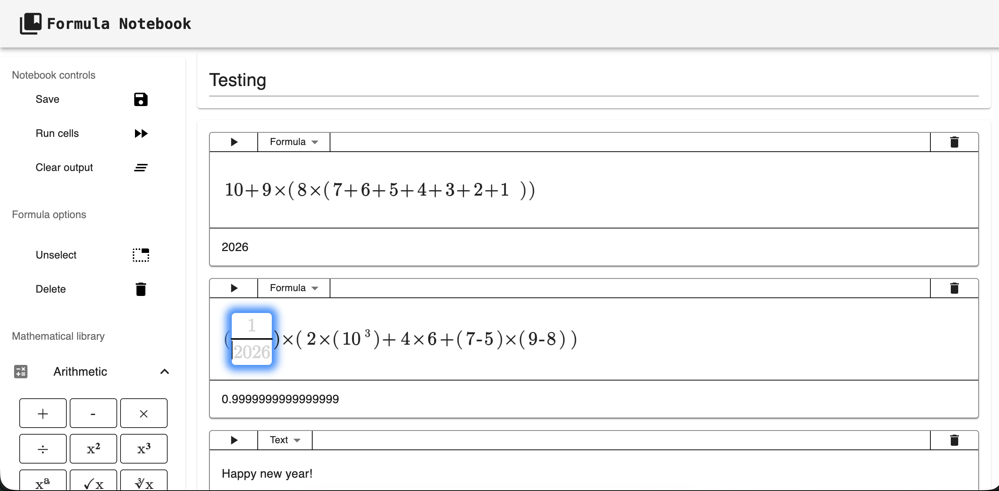

# Formula Notebook
A web-based notebook for editing, storing, and annotating mathematical formulas and calculations, inspired by related notebook-applications such as Jupyter notebook. The application is made with React (TypeScript) frontend and Spring Boot (Java) backend.


## Getting started
To run all the required applications (frontend, backend, database), make sure docker is installed on the system and run the following command using docker-compose:

````
docker-compose up -d
````

### Development
During development it is recommended to run only the database through a docker container, and run the backend and frontend locally.
To run only the database container, run the following:
```
docker-compose up postgres-db -d
```

For the backend api ``mvn spring-boot:run`` ([see more](./notebook-api/README.md)) and frontend ``npm run dev`` ([see more](./notebook-ui/README.md)) in their respective project folders.

## Features
Here are some of the current features of the application and possible use cases:
1. Create and organize notebooks and pages to structure work.
2. Add formula and calculation cells to write and run mathematical expressions.
3. Edit cells and re-run calculations to update results interactively.
4. Attach comments to cells or entire notebooks for explanations and discussion.
5. Save and load notebooks so work persists across sessions.
6. View rendered formulas and calculation outputs for clear presentation.

